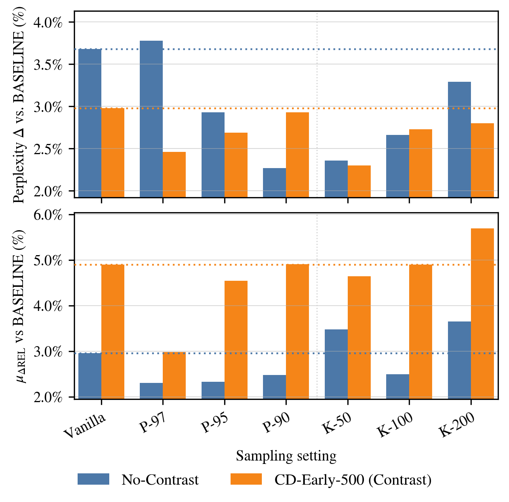
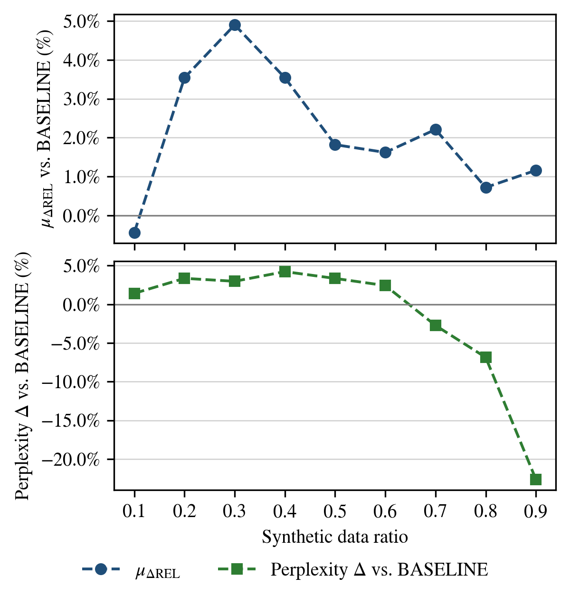

# Contrastive Decoding for Synthetic Data Generation in Low-Resource Language Modeling

Official code for the paper **"Contrastive Decoding for Synthetic Data Generation in Low-Resource Language Modeling"** by [Jannek Ulm](mailto:jannek.ulm@gmail.com), [Kevin Du](mailto:kevin.du@inf.ethz.ch), and [Vésteinn Snæbjarnarson](mailto:vest.snae@gmail.com) (ETH Zürich & University of Copenhagen), published at the **BabyLM Workshop, EMNLP 2025, Suzhou, China**.

- 📄 ACL Anthology: https://aclanthology.org/2025.babylm-main.2/
- 📄 arXiv: https://arxiv.org/abs/2510.08245

---

## TL;DR

We investigate whether **contrastive decoding (CD)** — a decoding strategy that amplifies the difference between a *good* and a *bad* language model — can be repurposed to generate **synthetic pre-training corpora** in a low-resource (100M-word, BabyLM) setting.

We train small (~100M-parameter) Llama-2-style models from scratch, use them to synthesize new corpora, mix the synthetic text with the original data, and train fresh models on the mixture. **Mixing synthetic data consistently helps**, and CD-generated data delivers the largest overall gains — especially on **reasoning-oriented tasks**.

## Key findings

- **Synthetic data helps.** Every synthetic-data regime beats the real-data-only `BASELINE` on the aggregate metric and on the language-modeling objective.
- **Contrastive decoding wins on reasoning.** CD (with an *early-checkpoint* bad model) achieves the strongest aggregate improvement (μ∆REL **+4.90%**, up to **+5.69%** with light top-k=200 truncation) and leads on reasoning/tracking benchmarks (BLiMP Supplement, Entity Tracking, EWoK, WUG).
- **Vanilla sampling wins on surface linguistics.** Non-contrastive ancestral sampling yields the lowest perplexity and the best BLiMP score, reinforcing core grammatical regularities.
- **It's the contrastive score, not the mask.** A `NO-CONTRAST + Vhead` control (head-masking only) does *not* reproduce CD's gains — the contrastive subtraction against a weaker model does the heavy lifting.
- **A simple, cheap "bad" model works best.** An *earlier training checkpoint* (`CD-Early-500`) of the same architecture makes a strong and training-free amateur model.
- **~30% synthetic is the sweet spot.** A 70% real / 30% synthetic mixture gives the best overall trade-off.

| Truncation sweep (CD vs. No-Contrast) | Mixing-ratio ablation |
| :---: | :---: |
|  |  |

---

## How it works

The full pipeline (Figure 1 in the paper):

1. **Train baselines.** Train ~100M-parameter Llama-2-style models from scratch on the real `TinyBabyLM` corpus (100M words).
2. **Pick GOOD / BAD models.** The `GOOD` model is the best checkpoint; the `BAD` (amateur) model is a weaker variant — e.g. an earlier checkpoint, a smaller model, or the same model run with inference-time attention dropout.
3. **Generate synthetic corpora (~100M tokens each)** from held-out seed prefixes using:
   - `NO-CONTRAST`: ancestral sampling from the good model,
   - `CD`: contrastive decoding (good − λ·bad, restricted to the α-head of the good model),
   - plus truncation variants (top-k / top-p / Vhead).
4. **Train mixed models.** Train new models from scratch on a 70/30 mixture of real and synthetic data.
5. **Evaluate & compare** to the `BASELINE` on the BabyLM suite with paired-bootstrap significance testing.

### Contrastive decoding score

For a good model `p_G` and bad model `p_B`, tokens are first restricted to the α-plausible head of `p_G`, then scored as

```
CD(x_i | x_<i) = log p_G(x_i | x_<i) − λ · log p_B(x_i | x_<i)
```

and sampled as logits. We use `α = 0.1` and `λ = 1` throughout (following Li et al., 2023).

---

## Repository structure

```
.
├── configs/                       # Model + tokenizer configs (GOOD model and smaller "bad" variants)
├── data/                          # Corpus download & TinyBabyLM construction
│   ├── download_data25.sh         #   fetch the BabyLM 2025 data from OSF
│   ├── unzip_data.sh
│   ├── create_tinystories_split.py#   build the TinyStories split
│   ├── load_datasets.py           #   assemble the TinyBabyLM corpus (train/eval/seed splits)
│   └── data_processing.py         #   tokenize / group / dataloader utilities
├── tokenizer/
│   └── train_tokenizer.py         # SentencePiece BPE tokenizer (32k vocab)
├── model/
│   └── load_model.py              # Build / load the Llama-2-style model from a config
├── train_llama_steps.py           # Train from scratch (baseline or real+synthetic mixture)
├── logits_processors.py           # CD, Vhead, top-k/top-p, dropout, n-gram logit processors
├── ensemble_generation.py         # Batched two-model (good/bad) generation loop
├── generate_synthetic_data.py     # Synthetic corpus generation (paper pipeline)
├── generate_synthetic_data_better.py  # Faster multi-worker refactor of the generator
├── combine_synthetic_datasets.py  # Merge per-process generation shards into one dataset
├── combine_synthetic_datasets_better.py
├── explore_synth_datasets.py      # Quick inspection of generated corpora
├── evals/                         # Evaluation + statistical analysis
│   ├── evaluate_checkpoint.py     #   perplexity on the TinyBabyLM eval split
│   ├── evaluate_many_models.py    #   batch evaluation driver
│   ├── generate_index_sets.py     #   fixed index sets for the paired bootstrap
│   ├── subsample_predictions*.py  #   bootstrap resampling of per-example scores
│   ├── extract_experiment_dataframe.py
│   ├── plot_experiment_seeds.py
│   └── diversity_score.py
├── scripts/                       # SLURM launchers
│   ├── experiments/1_baseline/            # train the baseline / GOOD models
│   ├── experiments/2_synthetic_generation/# generate all synthetic corpora (CD + variants)
│   ├── experiments/3_8000series_all/      # train mixed models + mixing-ratio ablation
│   ├── schedule_evals_pipeline25.sh       # launch the BabyLM eval pipeline for a model
│   └── launch_*bootstrap*/evals*.sh       # bootstrap + (re)run helpers
├── experiment_storyline.py        # Aggregation: reads bootstrap scores -> paper tables/metrics
├── plots_paper.ipynb              # Reproduce the figures and tables in the paper
├── envs/                          # Conda environments (llama = train/gen, babylm-eval = eval)
└── requirements.txt
```

> **Note on paths.** The shell scripts under `scripts/` were written for a SLURM cluster and contain absolute, machine-specific paths (e.g. `/cluster/...`) and `micromamba activate llama`. Treat them as reference recipes: update the paths, environment activation, and `#SBATCH` resource requests for your own setup. The Python entry points below are portable and can be run directly with `torchrun`.

---

## Setup

### 1. Environments

Training and generation use one environment, evaluation uses another (the BabyLM evaluation pipeline has conflicting dependencies).

```bash
# Training + synthetic-data generation
conda env create -f envs/llama.yml
conda activate llama
# (or, for a lighter/pip-only install: pip install -r requirements.txt)

# Evaluation (separate env)
conda env create -f envs/babylm-eval.yml
```

### 2. Download the data

The BabyLM corpus is hosted on OSF and fetched via `osfclient`:

```bash
pip install osfclient
bash data/download_data25.sh   # edit TARGET_DIR inside the script first
bash data/unzip_data.sh
```

Build the TinyStories split (used to replace CHILDES/BNC/Switchboard):

```bash
python data/create_tinystories_split.py
```

### 3. Construct the TinyBabyLM corpus

`TinyBabyLM` is a 100M-word corpus: Gutenberg (~27M) + SimpleWiki (~15M) + OpenSubtitles (~18M) + TinyStories (~40M). It is partitioned into disjoint **train**, **eval**, and **seed** splits (the seed split is used only for synthetic generation and is strictly held out).

```bash
python data/load_datasets.py
```

### 4. Train the tokenizer

A SentencePiece BPE tokenizer (32k vocab) trained on TinyBabyLM, shared across all experiments:

```bash
python tokenizer/train_tokenizer.py --config configs/tokenizer_tinybabylm.config --train
```

---

## Reproducing the experiments

All heavy jobs are multi-GPU. The examples below show the underlying `torchrun` commands; the `scripts/experiments/` launchers wrap these in SLURM job arrays over 10 seeds.

### Step 1 — Train baseline / GOOD models

```bash
torchrun --nproc_per_node=4 train_llama_steps.py \
    --seed 42 \
    --learning_rate 1e-3 \
    --lr_scheduler_type cosine \
    --max_train_steps 8000 \
    --eval_steps 500 \
    --checkpointing_steps 500 \
    --synthetic_data_ratio 0.0 \
    --dataset_dir /path/to/tinybabylm_dataset \
    --output_dir /path/to/checkpoints/baseline_seed42 \
    --init_model_config configs/babyllama_model.config \
    --compile_model
```

Batch of 256×1024 tokens (16 per device × 4 GPUs × grad-accum 4), AdamW, weight decay 0.1, cosine schedule with 150 warmup steps decaying to 0 by step 8000. Repeat over seeds 42–51 (n=10). See `scripts/experiments/1_baseline/`.

### Step 2 — Generate synthetic corpora

For contrastive decoding, `--good_model_path` is the selected GOOD checkpoint and `--bad_model_path` is the amateur (e.g. an early checkpoint at step 500):

```bash
torchrun --nproc_per_node=4 generate_synthetic_data.py \
    --cd_strategy contrastive \
    --good_model_path /path/to/GOOD/step_2500 \
    --bad_model_path  /path/to/GOOD/step_500 \
    --seed_dataset_path /path/to/tinybabylm_dataset/seed \
    --output_dataset_path /path/to/synth/cd_early_500 \
    --alpha 0.1 --contrast_strength 1.0 \
    --batch_size 16 --title "CD-Early-500"

# then merge the per-process shards into a single dataset
python combine_synthetic_datasets.py \
    --input_dir /path/to/synth/cd_early_500 \
    --output_dir /path/to/synth/cd_early_500/combined --cleanup
```

Supported `--cd_strategy` values: `no_contrast`, `contrastive`, `no_contrast_v_head`, `contrastive_dropout`, `contrastive_tail`, `contrastive_with_no_repeat_ngram`. Truncation (top-k / top-p) and the different "bad" model families (early checkpoint / smaller model / attention dropout) are covered by the scripts in `scripts/experiments/2_synthetic_generation/`.

### Step 3 — Train models on the real + synthetic mixture

Same as Step 1, but pointing at a synthetic corpus with a non-zero mixing ratio (0.3 = 70% real / 30% synthetic):

```bash
torchrun --nproc_per_node=4 train_llama_steps.py \
    --seed 42 --learning_rate 1e-3 --lr_scheduler_type cosine \
    --max_train_steps 8000 --eval_steps 500 --checkpointing_steps 500 \
    --dataset_dir /path/to/tinybabylm_dataset \
    --synthetic_dataset_dir /path/to/synth/cd_early_500/combined \
    --synthetic_data_ratio 0.3 \
    --output_dir /path/to/checkpoints/cd_early_500_mr03_seed42 \
    --compile_model
```

The mixing-ratio ablation (0.1 … 0.9) and every generation setting are enumerated in `scripts/experiments/3_8000series_all/`.

### Step 4 — Evaluate

Perplexity on the TinyBabyLM eval split uses `evals/evaluate_checkpoint.py`; downstream benchmarks use the [BabyLM 2025 evaluation pipeline](https://github.com/babylm/evaluation-pipeline-2025). Launch the full suite for a trained model with:

```bash
bash scripts/schedule_evals_pipeline25.sh /path/to/checkpoints/<model>
```

### Step 5 — Statistical analysis & figures

We select the best checkpoint per (method, task, seed), then run a **paired bootstrap** (B=1000) for confidence intervals and one-sided p-values:

```bash
python evals/generate_index_sets.py
bash   scripts/launch_bootstrap_benchmarks.sh /path/to/eval_results/8000_series_all
```

`experiment_storyline.py` reads the bootstrapped scores and produces the aggregated metrics and paper tables; `plots_paper.ipynb` regenerates all figures.

---

## Citation

If you use this code or the ideas in the paper, please cite:

```bibtex
@inproceedings{ulm-etal-2025-contrastive,
    title     = "Contrastive Decoding for Synthetic Data Generation in Low-Resource Language Modeling",
    author    = "Ulm, Jannek and Du, Kevin and Sn{\ae}bjarnarson, V{\'e}steinn",
    booktitle = "Proceedings of the First BabyLM Workshop",
    month     = nov,
    year      = "2025",
    address   = "Suzhou, China",
    publisher = "Association for Computational Linguistics",
    url       = "https://aclanthology.org/2025.babylm-main.2/",
    doi       = "10.18653/v1/2025.babylm-main.2",
    pages     = "29--41",
}
```

## Acknowledgments

This work builds on the [BabyLM Challenge](https://babylm.github.io/), [TinyStories](https://arxiv.org/abs/2305.07759), and Contrastive Decoding (Li et al., 2023). Vésteinn Snæbjarnarson is supported by the Pioneer Centre for AI, DNRF grant number P1.

## Contact

Questions are welcome — please open an issue or reach out to `jannek.ulm@gmail.com`.
